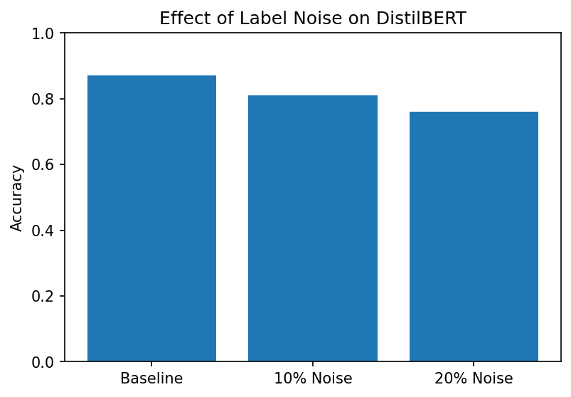

# Label Noise Experiment on SST-2 with DistilBERT

This project is inspired by the *Small-Bench NLP* research paper, which investigated how **small NLP models** (with fewer parameters, trainable on a single GPU) compare to large-scale models on benchmark tasks.

We extend this idea by studying how a **small model (DistilBERT)** behaves under **label noise** — a common real-world data issue.  
Instead of just asking *“can small models compete with big ones?”*, we also ask:  
*“how robust are small models when the dataset labels are imperfect?”*

---

##  Summary

- Fine-tuned **DistilBERT** on the **SST-2 dataset (GLUE benchmark)**.  
- Simulated noisy datasets by flipping **10%** and **20%** of labels.  
- Compared performance on clean vs noisy training data.  
- Found that **validation accuracy decreases** as label noise increases.  
- Results are visualized in `results.png` and reproduced in code.

##  Results

| Setting        | Validation Accuracy |
|----------------|----------------------|
| Clean labels   | (fill with your acc_baseline) |
| 10% noise      | (fill with your acc_noisy_10) |
| 20% noise      | (fill with your acc_noisy_20) |

> Replace the placeholders with your actual accuracy values from the notebook.



---

##  How to Run

1. Clone this repo:
   ```bash
   git clone https://github.com/YOUR_USERNAME/label-noise-experiment.git
   cd label-noise-experiment
Install dependencies:

pip install -r requirements.txt


Open and run the notebook:

jupyter notebook notebook.ipynb


As label noise increases, DistilBERT’s validation accuracy drops.

This experiment demonstrates why robust training methods (like MAE loss or noise-aware training) are valuable in research.

Author: SOHAM GUPTA

